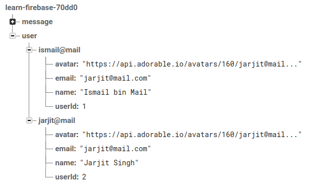
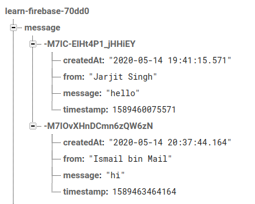
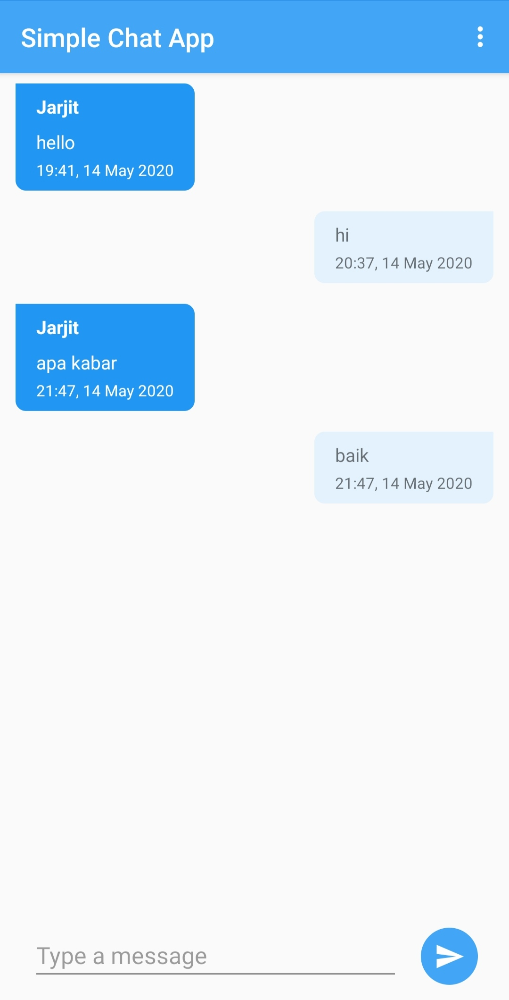
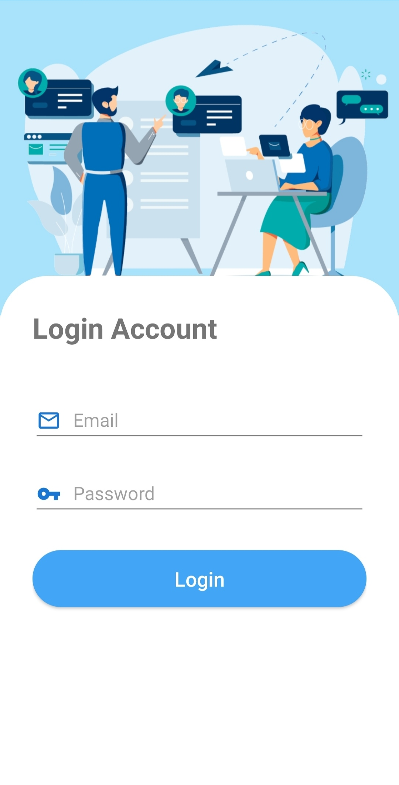

# Simple Chat App

## Overview
Simple chat app that using google authenticate and realtime database from Firebase. This simple chat app is use Architecture component with coroutines for threading, dagger2 for dependency injection, and room android for caching data chat.

## Firebase Structure
- User Structure

- Chat Structure

## Library
- [Dagger 2](https://github.com/google/dagger)
- [Room](https://developer.android.com/topic/libraries/architecture/room)
- [Glide](https://github.com/bumptech/glide)
- [Firebase Auth](https://firebase.google.com/docs/auth?authuser=0)
- [Firebase Database](https://firebase.google.com/docs/database/android/start?authuser=0)
- [Kotlin Coroutines](https://github.com/Kotlin/kotlinx.coroutines)

## Screenshots
<table>
        <tr>
<td></td>
<td></td>
        </tr>
</table>
